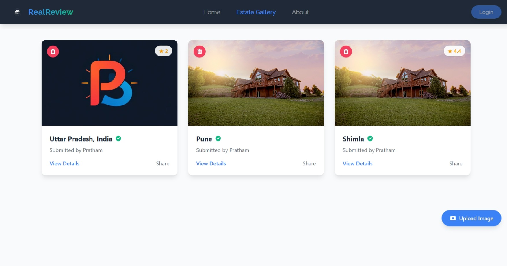
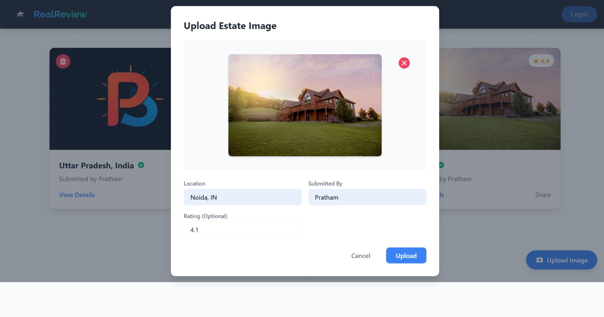
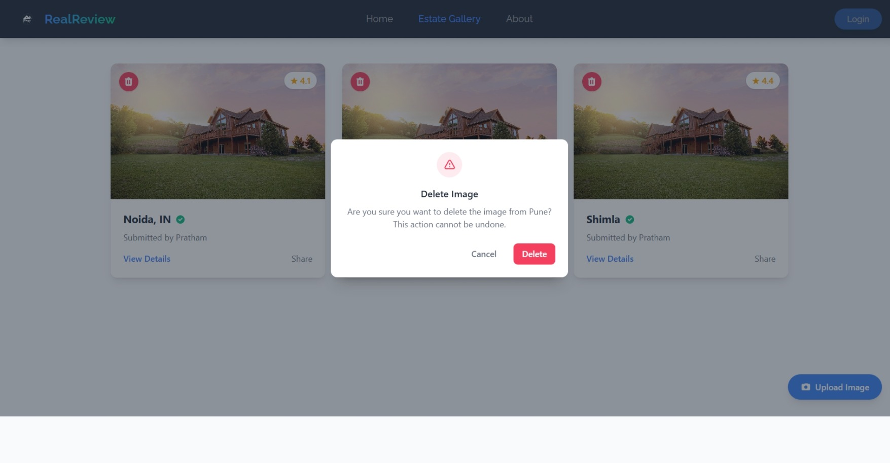
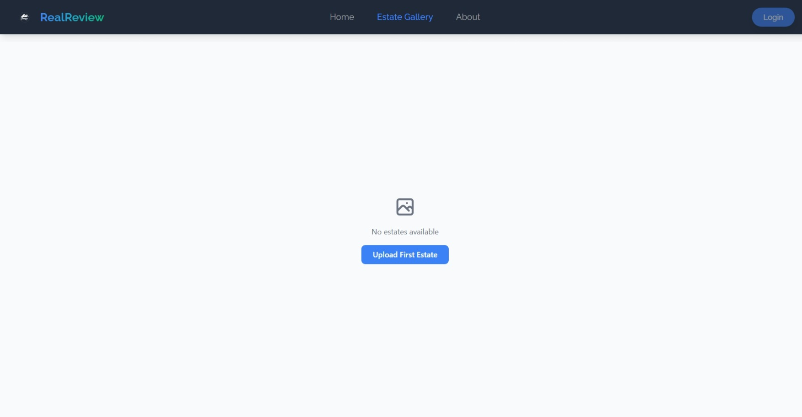
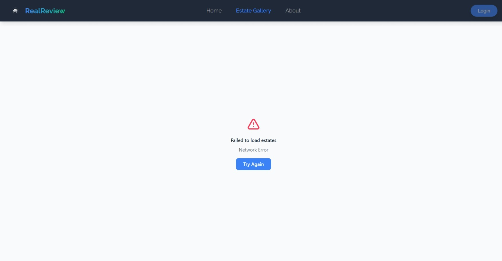

# Real Estate Image Gallery

A modern, responsive web application for managing and displaying real estate images with features like image upload, deletion, and rating system.

## Features

- 🖼️ **Image Gallery**: Display real estate images in a responsive grid layout
- 📤 **Image Upload**: Upload new estate images with location and rating information
- 🗑️ **Image Management**: Delete images with confirmation modal
- ⭐ **Rating System**: Add and display ratings for each estate
- 🎨 **Modern UI**: Built with Tailwind CSS and Framer Motion for smooth animations
- 📱 **Responsive Design**: Works seamlessly on desktop and mobile devices

## Tech Stack

- **Frontend Framework**: React + Vite
- **Styling**: Tailwind CSS
- **Animations**: Framer Motion
- **HTTP Client**: Axios
- **Environment Variables**: Vite Environment Variables

## Screenshots

### Gallery View

### Upload Image

### Delete Confirmation

### Empty State

### Error State

## License

This project is licensed under the MIT License - see the LICENSE file for details.
